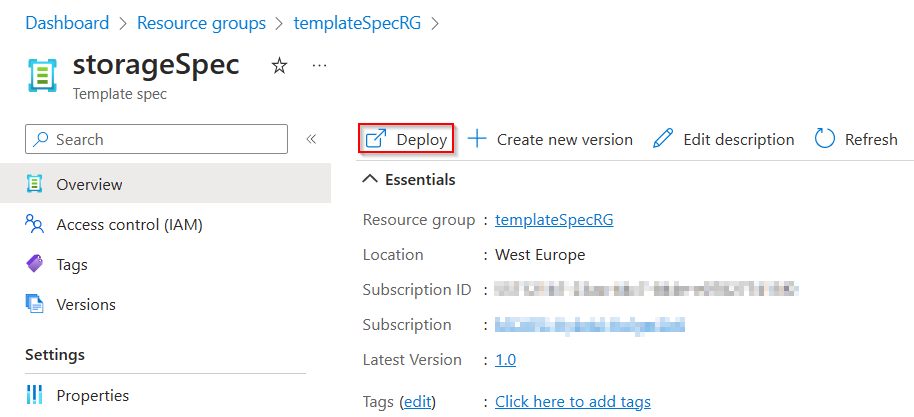

# Challenge 6

## Provision your template as template spec

### Open your Bicep config

1. Open the file ```main.bicep``` in VS Code.

### Create a template spec

1. Create a new resource group to contain the template spec.  
  ```az group create --name templateSpecRG --location westeurope```
2. Create the template spec in that resource group. Give the new template spec the name storageSpec.  
  ```az ts create --name storageSpec --version "1.0" --resource-group templateSpecRG --location westeurope --template-file ".\main.bicep"```

### Deploy the template spec

1. Open the Azure Portal and navigate to the resource group that you created in the previous step.
2. Click on the template spec that you created in the previous step.
3. Click on the "Deploy" button.  
  
4. Fill in the required parameters and click on the "Review + create" button.
5. Click on the "Create" button.

### Verify the deployment

1. Open the Azure Portal and navigate to the resource group that you created in the previous step.
2. Verify that the storage account has been created.

### Clean up

1. Delete the Resource Group  
  ```az group delete --name templateSpecRG --yes```